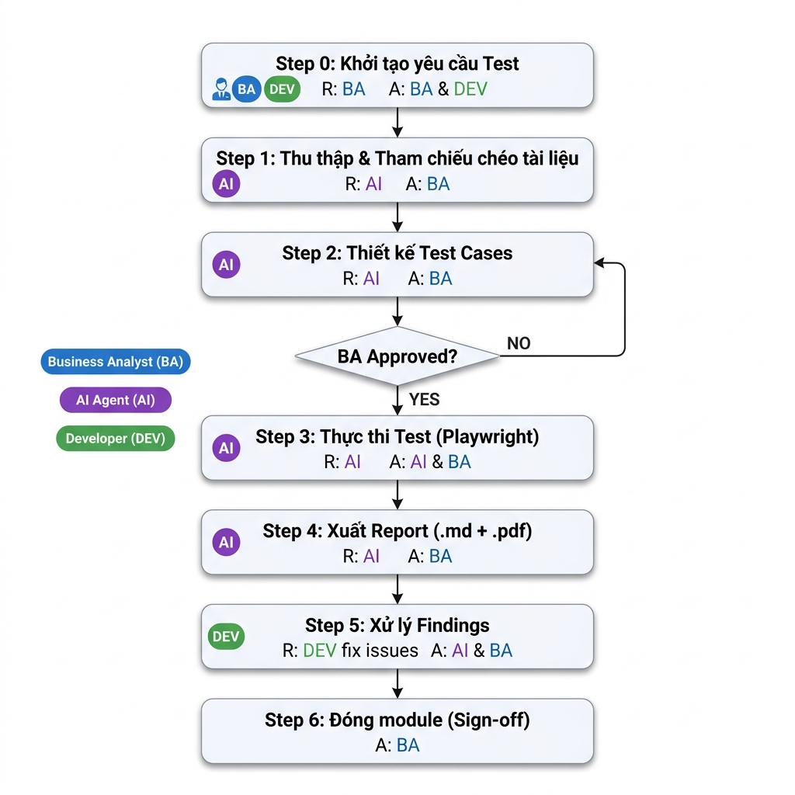

# 📋 MoveX AI Automation Testing — Guideline & Workflow

> **Phiên bản:** 3.0  
> **Cập nhật:** 2026-05-12  
> **Công cụ:** Antigravity + Playwright MCP Server  
> **Dự án:** MoveX — Master Data Management

---

## 1. Định nghĩa Roles

| Ký hiệu | Role | Mô tả |
|----------|------|-------|
| 📝 **BA** | Business Analyst | Cung cấp tài liệu nghiệp vụ, review test case đúng logic, xác nhận severity bug, phê duyệt report |
| 🤖 **AI** | AI Agent (Antigravity) | Phân tích tài liệu, tạo test case, viết script, thực thi test trên browser, xuất report |
| 👨‍💻 **DEV** | Developer | Chuẩn bị môi trường, nhận bug report, fix issues, confirm fix |

---

## 2. Tổng quan Workflow



---

## 3. Chi tiết từng Step

---

### 📌 Step 0 — Khởi tạo yêu cầu Test

| Hạng mục | Chi tiết |
|----------|---------|
| **Mục đích** | Xác định module cần test, chuẩn bị môi trường |
| **Ai ra yêu cầu** | 📝 **BA** hoặc 👨‍💻 **DEV** |
| **Ai nhận** | 🤖 **AI** |

**Input cần cung cấp cho AI:**

```
Test màn hình <Tên Module>
Base URL: http://localhost:3000
Login: admin@example.com / Admin@2026
```

**Checklist trước khi bắt đầu:**

| # | Hạng mục | Người chịu trách nhiệm |
|---|---------|------------------------|
| 1 | Frontend đang chạy (`npm run dev`) | 👨‍💻 DEV |
| 2 | Backend API đang chạy và có data | 👨‍💻 DEV |
| 3 | Tài khoản test hợp lệ | 👨‍💻 DEV |
| 4 | Tài liệu BA đã cập nhật trong `input/` | 📝 BA |

---

### 📚 Step 1 — Thu thập & Tham chiếu chéo tài liệu

| Hạng mục | Chi tiết |
|----------|---------|
| **Ai thực hiện** | 🤖 **AI** |
| **Ai hỗ trợ khi cần clarify** | 📝 **BA** |

AI tự động quét 6 nguồn trong `MoveX/input/`:

| # | Nguồn | Thông tin khai thác |
|---|-------|---------------------|
| 1 | Screen Specification | Layout, fields, navigation, API events |
| 2 | Systems Rule (SR-XX-YYY) | Business rules chi tiết |
| 3 | Error Code | Mã lỗi, messages |
| 4 | Actor & Permission | RBAC matrix |
| 5 | ERD & Entity | Cấu trúc data |
| 6 | API List | Endpoints, payload |

**Output:** Cross-Reference Map → ghi ở đầu file Test Cases.

---

### 📝 Step 2 — Thiết kế Test Cases

| Hạng mục | Chi tiết |
|----------|---------|
| **Ai tạo** | 🤖 **AI** |
| **Ai review & approve** | 📝 **BA** |
| **Ai hỗ trợ** (API/technical) | 👨‍💻 **DEV** |

**File output:** `e2e/specs/<module>/<module>-test-cases.md`

**7 danh mục test case:**

| Danh mục | Prefix | Ai nên review kỹ |
|----------|--------|-------------------|
| UI / Layout | `XX-UI-xxx` | 📝 BA |
| Functional / CRUD | `XX-FN-xxx` | 📝 BA |
| Validation | `XX-VL-xxx` | 📝 BA |
| Business Rules | `XX-BR-xxx` | 📝 **BA** (quan trọng nhất) |
| API | `XX-API-xxx` | 👨‍💻 DEV |
| Permission | `XX-PM-xxx` | 📝 BA |
| Error Handling | `XX-ER-xxx` | 👨‍💻 DEV |

**RACI:**

| Hoạt động | 🤖 AI | 📝 BA | 👨‍💻 DEV |
|-----------|-------|-------|---------|
| Tạo test cases | **R** | I | — |
| Review nghiệp vụ (đúng spec, đúng rule) | — | **R** | — |
| Hỗ trợ giải đáp kỹ thuật API | — | — | **R** |
| Approve test cases | — | **A** | — |

> **R** = Responsible (thực hiện) · **A** = Accountable (phê duyệt) · **I** = Informed

**✅ BA approve khi:**
- [ ] Đủ coverage cho tất cả fields trong Screen Spec
- [ ] Mỗi Systems Rule (SR-XX-YYY) có ít nhất 1 test case
- [ ] Có cả positive và negative scenarios
- [ ] Business rules test cases đúng logic nghiệp vụ

---

### 🚀 Step 3 — Thực thi Test

| Hạng mục | Chi tiết |
|----------|---------|
| **Ai thực hiện** | 🤖 **AI** (tự động thao tác browser qua Playwright MCP) |
| **Ai hỗ trợ khi lỗi môi trường** | 👨‍💻 **DEV** |

**Quy trình:**

```
🤖 AI mở browser → Đăng nhập → Điều hướng → Chạy test cases
   ├── Chụp screenshot trước/sau mỗi action
   ├── Đọc DOM / Accessibility Tree
   ├── So sánh kết quả thực tế vs kỳ vọng (BA spec)
   └── Ghi nhận: PASS / FAIL / WARNING / SKIP
```

**RACI:**

| Hoạt động | 🤖 AI | 📝 BA | 👨‍💻 DEV |
|-----------|-------|-------|---------|
| Thực thi test trên browser | **R** | — | — |
| Chụp screenshot minh chứng | **R** | — | — |
| Xử lý lỗi môi trường (server down, data lỗi) | — | — | **R** |

**Quy tắc:**

| # | Quy tắc |
|---|---------|
| 🔴 | Không sửa source code — chỉ tạo file trong `/e2e/` |
| 📸 | Mỗi màn hình ít nhất 1 screenshot |
| ⏱️ | Element không tìm thấy sau 2 lần → ghi SKIP |
| 🚫 | Cẩn thận với Delete/Deactivate |

---

### 📊 Step 4 — Xuất Report

| Hạng mục | Chi tiết |
|----------|---------|
| **Ai tạo** | 🤖 **AI** |
| **Ai review & approve** | 📝 **BA** |
| **Ai nhận** | 👨‍💻 **DEV** (phần Findings) |

**Output files:**
- `e2e/reports/<module>-test-report-<date>.md`
- `e2e/reports/<module>-test-report-<date>.pdf`
- `e2e/reports/<module>-*.png`

**Cấu trúc report:**

```markdown
# 🧪 <Module> — Test Execution Report

## 📊 Summary           → Tổng quan PASS/FAIL/SKIP
## 📋 Cross-Referenced   → Tài liệu đã tham chiếu
## 🔍 Detailed Results   → Kết quả chi tiết theo screen
## 🐛 Findings & Issues  → Bug/Issue (severity + screenshot)
## ⏭️ Skipped Tests      → Test chưa chạy + lý do
## ✅ Conclusion          → Kết luận
```

**RACI:**

| Hoạt động | 🤖 AI | 📝 BA | 👨‍💻 DEV |
|-----------|-------|-------|---------|
| Tạo report (.md + .pdf) | **R** | — | — |
| Review report | — | **R** | — |
| Xác nhận severity findings | — | **A** | C |
| Nhận findings để xử lý | — | — | **R** |

---

### 🐛 Step 5 — Xử lý Findings

| Hạng mục | Chi tiết |
|----------|---------|
| **Ai fix** | 👨‍💻 **DEV** |
| **Ai retest** | 🤖 **AI** |
| **Ai xác nhận fix** | 📝 **BA** |

**Severity & hành động:**

| Severity | Icon | Hành động | Ai quyết định |
|----------|------|-----------|---------------|
| **Critical** | 🔴 | Fix ngay, block release | 📝 BA |
| **High** | 🟠 | Fix trước release | 📝 BA |
| **Low** | 🟡 | Fix khi có thời gian (backlog) | 📝 BA |
| **Info** | 🟢 | Ghi nhận, không cần fix | 📝 BA |

**RACI:**

| Hoạt động | 🤖 AI | 📝 BA | 👨‍💻 DEV |
|-----------|-------|-------|---------|
| Phân loại severity | — | **A** | — |
| Fix bug | — | — | **R** |
| Retest sau khi fix | **R** | — | — |
| Xác nhận fix đạt yêu cầu | — | **A** | — |

---

### ✅ Step 6 — Đóng module (Sign-off)

| Hạng mục | Chi tiết |
|----------|---------|
| **Ai sign-off** | 📝 **BA** |

**Điều kiện sign-off:**

| # | Điều kiện | Bắt buộc |
|---|----------|----------|
| 1 | Pass rate ≥ 90% | ✅ |
| 2 | Không còn bug Critical/High chưa fix | ✅ |
| 3 | Report PDF đã review | ✅ |
| 4 | Findings Low/Info đã ghi nhận | ✅ |
| 5 | Regression test pass (nếu có fix) | ✅ |

---

## 4. RACI Matrix tổng hợp

| Step | 🤖 AI | 📝 BA | 👨‍💻 DEV |
|------|-------|-------|---------|
| **0. Khởi tạo** | I | R | R |
| **1. Thu thập tài liệu** | **R** | C | — |
| **2. Thiết kế Test Cases** | **R** | **A** | C |
| **3. Thực thi Test** | **R** | — | C |
| **4. Xuất Report** | **R** | **A** | I |
| **5. Xử lý Findings** | R (retest) | **A** | **R** (fix) |
| **6. Sign-off** | — | **A** | I |

> **R** = Responsible (thực hiện) · **A** = Accountable (phê duyệt) · **C** = Consulted · **I** = Informed

---

## 5. Cấu trúc thư mục

```
movex-fe-masterdata/
├── src/                            # ❌ KHÔNG ĐƯỢC SỬA ĐỔI
└── e2e/
    ├── GUIDELINE.md                # ← File này
    ├── specs/
    │   └── <module>/
    │       ├── <module>-test-cases.md     # Step 2
    │       └── <module>-*.spec.js         # Step 3
    ├── reports/
    │   ├── <module>-test-report-<date>.md  # Step 4
    │   ├── <module>-test-report-<date>.pdf # Step 4
    │   └── <module>-*.png                  # Screenshots
    ├── pages/                      # Page Object Models
    ├── helpers/                    # Utilities
    └── fixtures/                   # Test data
```

---

## 6. Module Tracking

| # | Module | SR Rules | Trạng thái | Report |
|---|--------|----------|------------|--------|
| 1 | **Vehicle** | SR-VH-001→008 | ✅ Done | [Report](reports/vehicle-test-report-2026-05-12.md) |
| 2 | **Business Partner** | SR-BP-001→009 | ✅ Done | [Dashboard](reports/html/index.html) |
| 3 | **Administrative Info** | SR-AD-001→005 | ✅ Done | [Dashboard](reports/html/index.html) |
| 4 | **Source Master** | SR-SM-001→009 | ✅ Done | [Dashboard](reports/html/index.html) |
| 5 | **Toll Station** | SR-TS-01→08 | ✅ Done | [Dashboard](reports/html/index.html) |
| 6 | **Routing** | SR-RT-001→008 | ✅ Done | [Dashboard](reports/html/index.html) |
| 7 | **Cost** | BR-COST-001→018 | ✅ Done | [Dashboard](reports/html/index.html) |
| 8 | **Services** | SR-SV-001→00N | ✅ Done | [Dashboard](reports/html/index.html) |
| 9 | **Pricing** | BR-PR-001→00N | ✅ Done | [Dashboard](reports/html/index.html) |
| 10 | **Common Code** | SR-CC-001→007 | ⏳ Pending | — |
| 11 | **Settings** | SR-SET-001→008 | ⏳ Pending | — |
| 12 | **Vendor Tariff** | SR-VT-001→00N | ✅ Done | [Dashboard](reports/html/index.html) |

---

## 7. Prompt mẫu

**Test đầy đủ (Step 1→4):**
```
Test màn hình <Module>
Base URL: http://localhost:3000
Login: admin@example.com / Admin@2026
```

**Chỉ tạo test cases để BA review (Step 1→2):**
```
Chỉ thực hiện Step 1 + Step 2 cho màn hình <Module>.
Tạo test cases, chưa cần chạy test. Chờ BA review.
```

**Chạy test sau khi BA đã approve (Step 3→4):**
```
Thực hiện Step 3 + Step 4 cho màn hình <Module>.
File test cases: e2e/specs/<module>/<module>-test-cases.md
```
